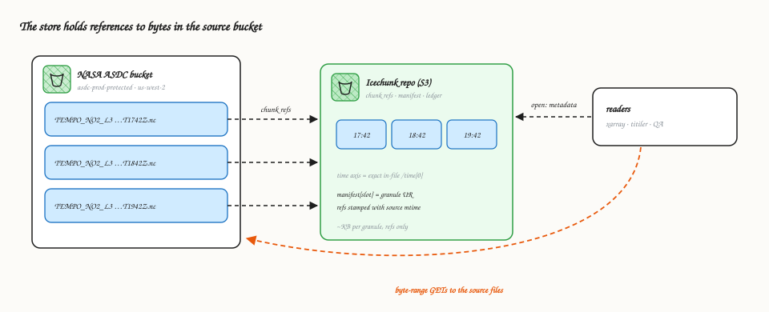
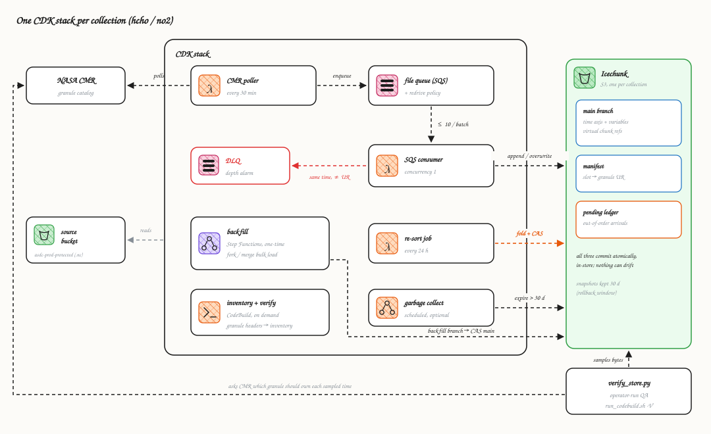
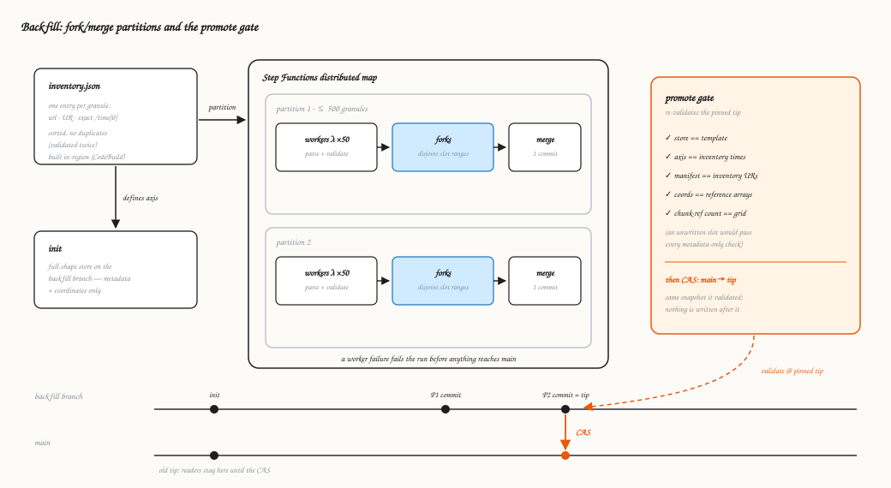
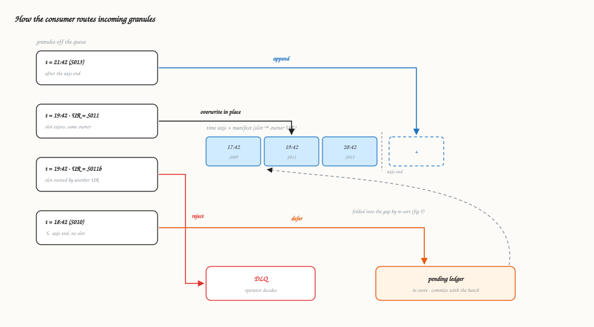
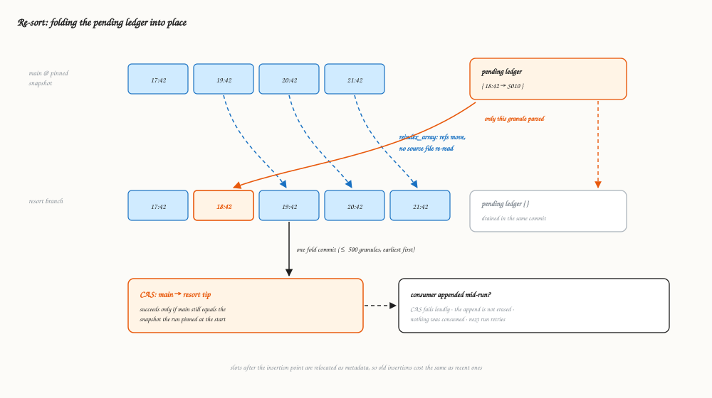
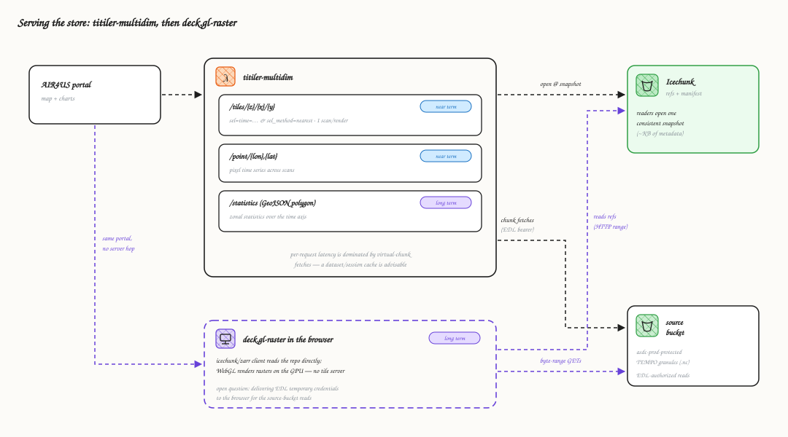

# Architecture

These figures show how TEMPO Level-3 granules (NO₂ and HCHO) are ingested
into one virtual Zarr store per collection, and how the pipeline guards
against serving wrong data.

In the figures, **blue** marks data (granules, time slots), **orange**
marks the correctness mechanism under discussion, and dashed lines are
asynchronous paths. The [README](../README.md) covers operations
(deployment, env settings, runbook); this document is the conceptual map.

**Reading path.** 30 seconds: the table below. 5 minutes: the table, then
[README → Forward processing](../README.md#forward-processing). The whole
picture: this document, figures in order.

## Why this design

Three properties of the TEMPO source drive everything unusual here. If
your dataset lacks a property, you do not need the machinery in that row —
and if a property ever changes, that row can be deleted:

| Source property | Forces | Delete it when |
|---|---|---|
| ASDC publishes no SNS topic for the source bucket | CMR poller + watermark | ASDC provides a notification topic (the queue subscribes directly; §2) |
| The in-file `/time` differs from the CMR and filename timestamps (`...T174200Z` holds 17:42:18.02), so a granule's slot on the axis is unknowable without reading the file | The ownership manifest; the pending ledger + re-sort job (a slot cannot be pre-created for a granule nobody has read; §4–5) | the metadata times become exact |
| The DAAC revises and republishes granules **to the same S3 URI** | UR-checked routing (overwrite the same UR in place, reject a different UR to an operator); modification-time-stamped references so stale reads fail loudly (§1, §4) | never, for this DAAC |

Everything else — the fork/merge backfill, CAS promotes, pinned-tip
validation — is the standard machinery of the
[template](https://github.com/developmentseed/virtualizarr-data-pipelines)
family, not TEMPO-specific.

### If you know the template

TEMPO is the template plus the three rows above. The backfill (§3) and the
CDK shape (§2) are stock. The stock forward path assumes announced files
that append in publication order; TEMPO's forward path cannot (about 43%
of publications arrive out of scan-time order, and slot positions are only
knowable from file contents), so the consumer becomes a router (§4) and a
scheduled re-sort (§5) folds deferred granules in. For the contrasting
simple profile — trusted, regularly-spaced coordinates, notifications, no
identity checks — see a forecast pipeline like NAQFC: create/region/append
modes and no manifest, ledger, re-sort, or poller.

### If you come from virtualizing stores in notebooks

The store is the thing your notebook builds —
`concat(sorted_by_in_file_time(granules), dim="time")` written to Icechunk
— maintained continuously instead of rebuilt. Each piece of the pipeline
is one notebook step made incremental, concurrent, or loud:

| In a notebook you... | Here |
|---|---|
| `open_virtual_dataset(...)` per file | what a worker or the consumer does per granule, plus validation against a generated template (§3–4) |
| `concat` everything, sorted, and write to Icechunk | the backfill: the same concat, partitioned across parallel workers with fork/merge, validated before `main` moves (§3) |
| re-run the notebook when new files appear | forward processing: append the new granule instead of rebuilding 13,000+ (§2, §4) |
| a file arrived late → re-sort the list, re-run | the pending ledger + re-sort job: the incremental version — inserted slots are parsed, everything after them is relocated as pure metadata, nothing is re-read (§5) |
| keep `granules` as a Python list | the store manifest: the same list, stored *inside* the store so it commits atomically with the data (§2) |
| eyeball the result | `verify_store.py`: samples slots, asks CMR who should own them, compares bytes against the source files (§2) |
| never notice an upstream file was silently replaced | modification-time-stamped references: reads of stale references fail instead of returning changed bytes (§1) |

The parts with no notebook counterpart — branches, compare-and-swap,
pinned tips — exist because several writers (consumer, re-sort, backfill)
share one store and readers must never see it half-written. The
[glossary](#glossary) defines each in a few lines.

## 1. Virtual stores

The store does not copy NASA's data. It is a Zarr-shaped index over the
original NetCDF granules: per-chunk byte-range references, a time axis
built from each granule's in-file scan time, and bookkeeping that records
which granule owns which slot. Readers open a few KB of metadata and then
fetch bytes directly from the source bucket.

Each reference records the source object's modification time. If a granule
is overwritten in place upstream, reads of the stale references fail
instead of returning bytes from a changed file.

## 2. Stack components

Each collection is deployed as its own CDK stack, configured through typed
settings (pydantic `BaseSettings`). A scheduled Lambda polls CMR for new
revisions, an SQS queue feeds a consumer Lambda with reserved concurrency
1, scheduled jobs handle re-sort, garbage collection, and the backfill
state machine, and an on-demand CodeBuild project runs the in-region jobs —
backfill inventory builds and store verification. The manifest and pending ledger are stored inside the
Icechunk repo and commit atomically with the data they describe.

`verify_store.py` runs outside the pipeline's write path (started
in-region through the same CodeBuild project, `run_codebuild.sh -V`, since
source reads are region-locked to us-west-2). It asks CMR which granule
should own each sampled time and compares stored bytes against the source
file, so errors in the pipeline's own bookkeeping are still caught.

## 3. Backfill

The historical archive is loaded with a partitioned fork/merge. The
inventory is built by the stack's CodeBuild project, because the DAAC's
temporary source-bucket credentials only work from us-west-2; each run
executes the committed builder script from a source zip of the repo. The
validated inventory defines the full time axis up front, workers write
disjoint slot ranges into Icechunk forks, and each partition is merged
into a single commit on the `backfill` branch. The promote step
re-validates the finished store at a pinned snapshot and then moves `main`
with a compare-and-swap, so `main` never points at a partial store.

The chunk-reference count check exists because an unwritten slot reads as
fill values and passes the metadata checks. Counting stored references
against the chunk grid confirms that every slot was written.

## 4. Forward processing

Publication order routinely diverges from scan-time order: in a recent
14-day window about 43% of adjacent publications were out of order —
mostly years-old archive granules drip-fed between new scans, plus 2–3%
genuinely swapped adjacent scans (`scripts/measure_publish_order.py`
re-measures this against live CMR). The consumer therefore cannot assume
arrival order matches time order. Each granule is routed against the axis
and the ownership manifest. Granules that cannot be placed safely are
deferred to the pending ledger or sent to the DLQ for an operator.

Append and same-owner overwrite are the only automatic writes. A time
collision with a different granule UR is left to an operator.

## 5. Re-sort

A scheduled job folds the pending ledger into the store. Icechunk's
`reindex_array` relocates the slots after the insertion point as metadata,
without re-reading any source file, and only the inserted granules are
parsed. The fold and the ledger drain happen in one commit, and `main`
moves by compare-and-swap.

If the consumer appended to `main` while the re-sort ran, the CAS fails:
the append survives, no ledger entry was consumed, and the next run
retries against the new tip. Each run folds at most 500 granules.

## 6. Serving

The store is read through titiler-multidim, and eventually directly.
Near term, the portal renders map tiles through `/tiles` (each render
selects one scan with `sel=time` and nearest matching — a multi-time
variable cannot reach the renderer) and reads pixel time series through
`/point`; both passed the smoke test against real stores. Longer term,
`/statistics` computes zonal statistics for a GeoJSON polygon across the
time axis. In every case titiler opens the repo at a snapshot and fetches
the referenced bytes from the source bucket with EDL-authorized virtual
chunk fetches. Per-request latency is dominated by those fetches, so a
dataset/session cache is advisable in production.

deck.gl-raster is the long-term alternative that removes the tile server:
an icechunk/zarr client in the browser reads the repo's metadata and
references directly, and WebGL renders the rasters on the GPU. Both paths
read the same snapshots; nothing is duplicated for serving. The open
question for the browser path is credential delivery — the byte-range
reads against the source bucket that titiler performs server-side with an
EDL bearer token would need EDL temporary credentials in the browser.

## Glossary

- **Granule** — one NetCDF file: a single TEMPO scan of North America,
  published roughly hourly during daylight.
- **Granule UR** — the granule's unique identifier in CMR. The manifest's
  notion of ownership: a slot belongs to exactly one UR.
- **Collection** — one TEMPO product (NO₂ or HCHO L3 V04). Each collection
  gets its own stack and its own store.
- **CMR** — NASA's Common Metadata Repository, the catalog of record for
  granules. The poller watches its revision dates; verification uses it as
  ground truth independent of the pipeline's own bookkeeping.
- **Virtual reference** — a pointer (source URL, byte offset, length, and
  the source object's modification time) standing in for a chunk's bytes.
  The store consists of these references.
- **Icechunk snapshot / branch** — git-like versioning for the store:
  every commit is an immutable snapshot; branches (`main`, `backfill`,
  `resort`) are movable pointers to snapshots. Readers always see a
  complete, consistent snapshot.
- **CAS (compare-and-swap)** — a branch move that succeeds only if the
  branch still points at the snapshot the mover expected. The only way
  anything reaches `main`; a promote that races a concurrent commit fails
  instead of overwriting it.
- **Pinned tip** — the snapshot a run looks up once at its start.
  Validation and promotion target that same object, so a branch moving
  mid-run cannot substitute an unvalidated snapshot.
- **Fork / merge** — Icechunk's cooperative distributed write: workers
  write disjoint regions on uncommitted forks of a session, which merge
  into a single commit.
- **Slot** — one position on the store's time axis, keyed to a granule's
  exact in-file `/time[0]` (which differs from the filename timestamp).
- **Store manifest** — two string arrays on the time axis recording each
  slot's owning granule UR and URL. Lives inside the store and commits
  atomically with the data it describes.
- **Pending ledger** — the in-store record of granules that arrived out of
  time order: consumed from the queue, not yet placed. Drained by the
  re-sort job.
- **`reindex_array`** — Icechunk operation that relocates chunk references
  to new indices as pure metadata. This makes insertion into the middle of
  the axis cheap: downstream slots are re-addressed, not re-read.
- **Promote gate** — the backfill's final validation pass at the pinned
  tip (template, axis, manifest, coordinates, chunk-reference counts) that
  must pass before the CAS moves `main`.
- **Store template** — a pydantic-zarr `GroupSpec` generated from
  reference granules, declaring the store's exact expected structure.
  Every granule is validated against it before writing.
- **Watermark** — the persisted CMR revision timestamp the poller resumes
  from, so restarts neither miss nor re-enqueue granules. The only
  pipeline state living outside the store.
- **DLQ / redrive policy** — the dead-letter queue receives messages two
  ways: the consumer *rejects* a granule whose time slot is owned by a
  different UR, and SQS's redrive policy automatically moves any message
  that has failed processing 20 times. Either way, a depth alarm notifies
  an operator.
- **EDL** — Earthdata Login: NASA credentials exchanged for temporary S3
  access to read the protected source granules.
